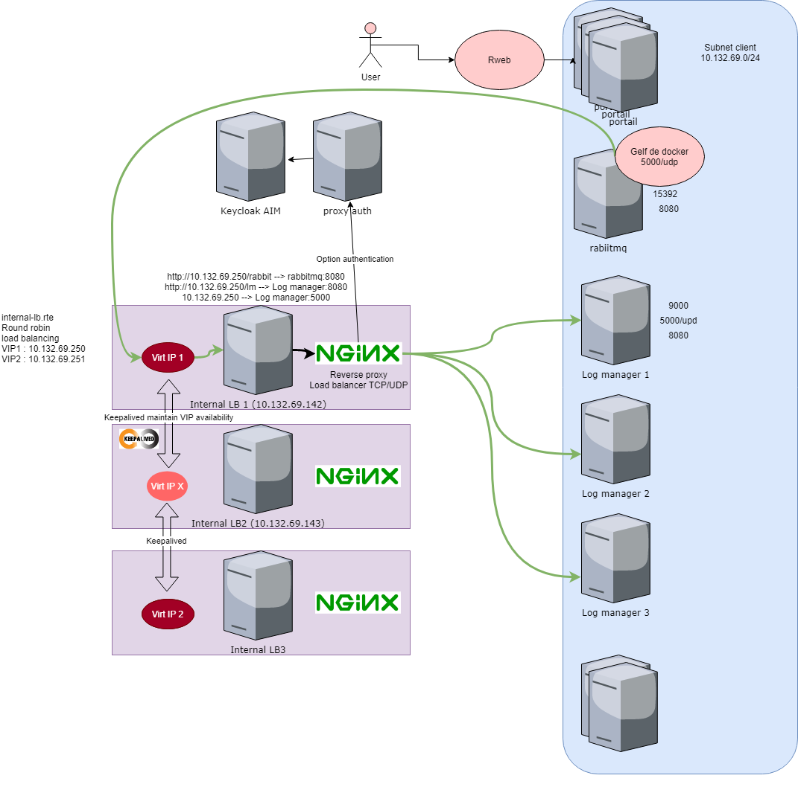
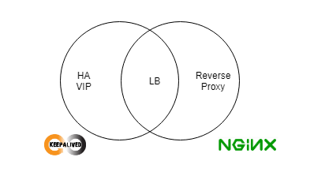

# Load balancer POC

A POC to create an internal load balancer using keepalived and nginx.

## Schema



## Overlapping functionalities


* The load balancing functionality can be done either with keepalived or nginx.

## VIP HA config with keepalived

* The configuration file of keepalived is `/etc/keepalived/keepalived.conf`.
* The following content is the configuration of the first node. A similar file must be configured on the other nodes.
* On the other nodes, the `state` and `priority` must be changed.
* In the following configuration:
    * There are 2 VIP (this is to spread the load on the both lb)
    * VIP 10.132.69.250 is the `MASTER` with the highest priority, so it will run  on this node by default.
    * VIP 10.132.69.251 is a `BACKUP` with not the highest priority, so it will not run on this node unless if the preferred node is not available.
    * The `vrrp_script` part define a track script that will be called every 2 seconds to ensure the monitored service is active.

```
vrrp_script chk_myscript {
  script       "/usr/local/bin/check.sh"
  interval 1   # check every 2 seconds
  fall 2       # require 2 failures for KO
  rise 2       # require 2 successes for OK
}

vrrp_instance VI_1 {
        state MASTER
        interface ens192
        virtual_router_id 51
        priority 255
        advert_int 1
        authentication {
              auth_type PASS
              auth_pass 12345
        }
        virtual_ipaddress {
              10.132.69.250/25
        }
        track_script {
              chk_myscript
        }
}

vrrp_instance VI_2 {
        state BACKUP
        interface ens192
        virtual_router_id 52
        priority 254
        advert_int 1
        authentication {
              auth_type PASS
              auth_pass 12345
        }
        virtual_ipaddress {
              10.132.69.251/25
        }
       track_script {
              chk_myscript
        }
}

```

## Check script to monitor nginx status

This is a simple example, the check script ensure that nginx container is available. It it is not the case, then the vip is moved to another node.
```
$ cat /usr/local/bin/check.sh
#!/bin/bash

set -euo pipefail
IFS=$'\n\t'

docker ps -f name=nginx | grep "nginx"
```

As mentioned above, to spread the load to 2 load balancers, a simple round robin dns can be configured.

Each call to the internal-lb will be sent

First call to:
FQDN: internal-lb --> 10.132.69.250
                  --> 10.132.69.251

Next call to:
FQDN: internal-lb --> 10.132.69.251
                  --> 10.132.69.250

Next call to:
FQDN: internal-lb --> 10.132.69.250
                  --> 10.132.69.251

## Active/active configuration with a round robin dns


## Load balancing with keepalived (not the solution chosen)
i
```
virtual_server 10.132.69.250 15673 {
    delay_loop 20
    lb_algo rr
    lb_kind DR
#    persistence_timeout 360
    protocol TCP
    real_server 10.132.69.157 15673 {
        weight 1
        TCP_CHECK {
            connect_timeout 3
        }
    }
    real_server 10.132.69.158 15673 {
        weight 1
        TCP_CHECK {
            connect_timeout 3
        }
    }
}
```


## Load balancing with nginx
```
[root@PF9SODECOFER114 ~]# cat nginx/nginx.conf
user  nginx;
worker_processes  5;

error_log  /var/log/nginx/error.log warn;
pid        /var/run/nginx.pid;


events {
    worker_connections  4096;
}

stream {
    upstream rabbit {
        server 10.132.69.138:15672 max_fails=2 fail_timeout=30s;
        server 10.132.69.157:15672 max_fails=2 fail_timeout=30s;
        server 10.132.69.158:15672 max_fails=2 fail_timeout=30s;
    }

  server {
      listen 15672;
      proxy_pass rabbit;
  }

    upstream amqp {
        server 10.132.69.138:5672 max_fails=2 fail_timeout=30s;
        server 10.132.69.157:5672 max_fails=2 fail_timeout=30s;
        server 10.132.69.158:5672 max_fails=2 fail_timeout=30s;
    }

  server {
      listen 5672;
      proxy_pass amqp;
  }

    upstream elasticsearch {
        server 10.132.69.159:9200 max_fails=2 fail_timeout=30s;
        server 10.132.69.160:9200 max_fails=2 fail_timeout=30s;
        server 10.132.69.161:9200 max_fails=2 fail_timeout=30s;
    }

  server {
      listen 9200;
      proxy_pass elasticsearch;
  }

    upstream logstash {
        server 10.132.69.159:5000 max_fails=2 fail_timeout=30s;
        server 10.132.69.160:5000 max_fails=2 fail_timeout=30s;
        server 10.132.69.161:5000 max_fails=2 fail_timeout=30s;
    }

  server {
      listen 5000 udp;
      proxy_pass logstash;
  }

    upstream kibana {
        server 10.132.69.159:8081 max_fails=2 fail_timeout=30s;
        server 10.132.69.160:8081 max_fails=2 fail_timeout=30s;
        server 10.132.69.161:8081 max_fails=2 fail_timeout=30s;
    }

  server {
      listen 8082;
      proxy_pass kibana;
  }

    upstream data-reference-postgres {
        server 10.132.69.145:15432 max_fails=2 fail_timeout=30s;
        server 10.132.69.146:15432 max_fails=2 fail_timeout=30s;
        server 10.132.69.147:15432 max_fails=2 fail_timeout=30s;
    }

  server {
      listen 15432;
      proxy_pass data-reference-postgres;
  }

    upstream data-reference {
        server 10.132.69.145:8083 max_fails=2 fail_timeout=30s;
        server 10.132.69.146:8083 max_fails=2 fail_timeout=30s;
        server 10.132.69.147:8083 max_fails=2 fail_timeout=30s;
    }

  server {
      listen 8083;
      proxy_pass data-reference;
  }

    upstream demo {
        server 10.132.69.157:15673 max_fails=2 fail_timeout=30s;
        server 10.132.69.158:15673 max_fails=2 fail_timeout=30s;
    }

  server {
      listen 15673;
      proxy_pass demo;
  }
}


```

## Reverse proxy configuration

```
http {
    upstream rabbit {
        server 10.132.69.138:15672 max_fails=2 fail_timeout=30s;
        server 10.132.69.157:15672 max_fails=2 fail_timeout=30s;
        server 10.132.69.158:15672 max_fails=2 fail_timeout=30s;
    }

    server { # simple reverse-proxy
        listen       15672;
        server_name  decofer-rabbit-int.applispfref.sipfref.local;
        #access_log   logs/domain2.access.log  main;


        # pass requests for dynamic content to rails/turbogears/zope, et al
        location /toto {
          proxy_pass      http://rabbit/;
        }
        location /js {
          proxy_pass      http://rabbit;
        }
        location /img {
          proxy_pass      http://rabbit;
        }
      }
}
```


## Side effect on ELK

```
[root@PF9SODECOFER134 ~]# cat logstash.conf
input {
    gelf {
        port => "${INPUT_UDP_PORT}"
        type => docker

    }
    tcp {
        port => "${INPUT_TCP_PORT}"
        type => syslog
        codec => json_lines
    }
    http {
        port => "${INPUT_HTTP_PORT}"
        codec => "json"
    }
}

filter {
    if [logger_name] =~ "metrics" {
        kv {
            source => "message"
            field_split_pattern => ", "
            prefix => "metric_"
        }
        mutate {
            convert => { "metric_value" => "float" }
            convert => { "metric_count" => "integer" }
            convert => { "metric_min" => "float" }
            convert => { "metric_max" => "float" }
            convert => { "metric_mean" => "float" }
            convert => { "metric_stddev" => "float" }
            convert => { "metric_median" => "float" }
            convert => { "metric_p75" => "float" }
            convert => { "metric_p95" => "float" }
            convert => { "metric_p98" => "float" }
            convert => { "metric_p99" => "float" }
            convert => { "metric_p999" => "float" }
            convert => { "metric_mean_rate" => "float" }
            convert => { "metric_m1" => "float" }
            convert => { "metric_m5" => "float" }
            convert => { "metric_m15" => "float" }
            # No need to keep message field after it has been parsed
            remove_field => ["message"]
        }
    }
    if [type] == "syslog" {
        mutate {
            add_field => { "instance_name" => "%{app_name}-%{host}:%{app_port}" }
        }
    }
    mutate {
        # workaround from https://github.com/elastic/logstash/issues/5115
        add_field => { "[@metadata][LOGSTASH_DEBUG]" => "${LOGSTASH_DEBUG:false}" }
    }
    mutate {
        replace => { "source_host" => "%{host}.applispfref.sipfref.local" }
    }
    dns {
        resolve => [ "source_host" ]
        action => "replace"
    }
}

output {
    elasticsearch {
        hosts => ["${ELASTICSEARCH_HOST}:${ELASTICSEARCH_PORT}"]
    }
    if [@metadata][LOGSTASH_DEBUG] == "true" {
        stdout {
            codec => rubydebug
        }
    }
}

```


