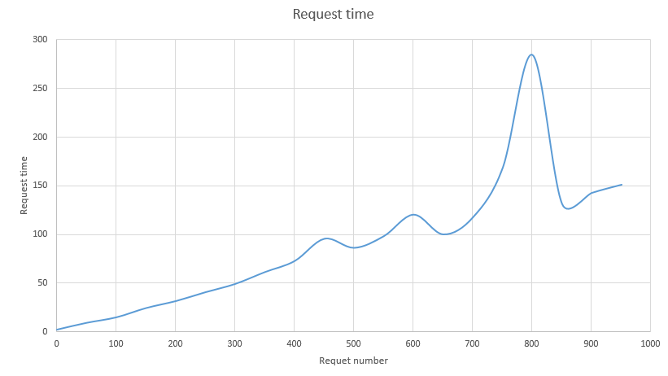

# Load balancer POC

A POC to create an internal load balancer using keepalived and nginx.

## Schema


## Overlapping functionalities


* The load balancing functionality can be done either with keepalived or nginx.

## VIP HA config with keepalived

* The configuration file of keepalived is `/etc/keepalived/keepalived.conf`.
* The following content is the configuration of the first node. A similar file must be configured on the other nodes.
* On the other nodes, the `state` and `priority` must be changed.
* In the following configuration:
    * There are 2 VIP (this is to spread the load on the both lb)
    * VIP 10.132.69.250 is the `MASTER` with the highest priority, so it will run  on this node by default.
    * VIP 10.132.69.251 is a `BACKUP` with not the highest priority, so it will not run on this node unless if the preferred node is not available.
    * The `vrrp_script` part define a track script that will be called every 2 seconds to ensure the monitored service is active.

```
vrrp_script chk_myscript {
  script       "/usr/local/bin/check.sh"
  interval 1   # check every 2 seconds
  fall 2       # require 2 failures for KO
  rise 2       # require 2 successes for OK
}

vrrp_instance VI_1 {
        state MASTER
        interface ens192
        virtual_router_id 51
        priority 255
        advert_int 1
        authentication {
              auth_type PASS
              auth_pass 12345
        }
        virtual_ipaddress {
              10.132.69.250/25
        }
        track_script {
              chk_myscript
        }
}

vrrp_instance VI_2 {
        state BACKUP
        interface ens192
        virtual_router_id 52
        priority 254
        advert_int 1
        authentication {
              auth_type PASS
              auth_pass 12345
        }
        virtual_ipaddress {
              10.132.69.251/25
        }
       track_script {
              chk_myscript
        }
}

```

## Check script to monitor nginx status

This is a simple example, the check script ensure that nginx container is available. It it is not the case, then the vip is moved to another node.
```
$ cat /usr/local/bin/check.sh
#!/bin/bash

set -euo pipefail
IFS=$'\n\t'

docker ps -f name=nginx | grep "nginx"
```

## Active/active configuration with a round robin dns

As mentioned above, to spread the load to 2 load balancers, a simple round robin dns can be configured.

Each call to the internal-lb will be sent alternatively to one address then the other.

First call to:
FQDN: internal-lb --> 10.132.69.250
                  --> 10.132.69.251

Next call to:
FQDN: internal-lb --> 10.132.69.251
                  --> 10.132.69.250

Next call to:
FQDN: internal-lb --> 10.132.69.250
                  --> 10.132.69.251


## Load balancing with keepalived (not the solution chosen)

```
virtual_server 10.132.69.250 15673 {
    delay_loop 20
    lb_algo rr
    lb_kind DR
#    persistence_timeout 360
    protocol TCP
    real_server 10.132.69.157 15673 {
        weight 1
        TCP_CHECK {
            connect_timeout 3
        }
    }
    real_server 10.132.69.158 15673 {
        weight 1
        TCP_CHECK {
            connect_timeout 3
        }
    }
}
```
Keepalived can be used as a load balancer.
One of the benefits is the direct routing mode. In this mode the load balanced servers will answer directly to the client from a network perspective.
It means that the traffic going back to the client will not pass through the load balancer. It is better for performance, but more complex to implement.

```
ip l add dummy0 type dummy
ip a add 10.132.69.250 dev dummy0
ip l set  dummy0 up
ip r add 10.132.169.250/32 dev dummy0
```
To use this mode you need to set in interface with the VIP address on the servers.
* the dummy interface type is suitable for this usage as it does not answer to arp requests that will confuse the switches. (duplicate ip vip and dummy ones on servers)
* a static route must be defined on the servers to answer using the correct (vip) address to the clients.

```
# minimum time interval for refreshing gratuitous ARPs while MASTER
vrrp_garp_master_refresh 60  # secs, default 0 (no refreshing)
```
https://serverfault.com/questions/821809/keepalived-send-gratuitous-arp-periodically

Not fully tested, but sometimes servers could lost the VIP arp assigned address. To avoid this there is the `vrrp_garp_master_refresh` parameter that will periodically send the gratuitous ARP packet packet making sure all systems will know the correct ARP address of the VIP.


## Load balancing with nginx
```
[root@PF9SODECOFER114 ~]# cat nginx/nginx.conf
user  nginx;
worker_processes  5;

error_log  /var/log/nginx/error.log warn;
pid        /var/run/nginx.pid;


events {
    worker_connections  4096;
}

stream {
    upstream rabbit {
        server 10.132.69.138:15672 max_fails=2 fail_timeout=30s;
        server 10.132.69.157:15672 max_fails=2 fail_timeout=30s;
        server 10.132.69.158:15672 max_fails=2 fail_timeout=30s;
    }

  server {
      listen 15672;
      proxy_pass rabbit;
  }

    upstream amqp {
        server 10.132.69.138:5672 max_fails=2 fail_timeout=30s;
        server 10.132.69.157:5672 max_fails=2 fail_timeout=30s;
        server 10.132.69.158:5672 max_fails=2 fail_timeout=30s;
    }

  server {
      listen 5672;
      proxy_pass amqp;
  }

    upstream elasticsearch {
        server 10.132.69.159:9200 max_fails=2 fail_timeout=30s;
        server 10.132.69.160:9200 max_fails=2 fail_timeout=30s;
        server 10.132.69.161:9200 max_fails=2 fail_timeout=30s;
    }

  server {
      listen 9200;
      proxy_pass elasticsearch;
  }

    upstream logstash {
        server 10.132.69.159:5000 max_fails=2 fail_timeout=30s;
        server 10.132.69.160:5000 max_fails=2 fail_timeout=30s;
        server 10.132.69.161:5000 max_fails=2 fail_timeout=30s;
    }

  server {
      listen 5000 udp;
      proxy_pass logstash;
  }

    upstream kibana {
        server 10.132.69.159:8081 max_fails=2 fail_timeout=30s;
        server 10.132.69.160:8081 max_fails=2 fail_timeout=30s;
        server 10.132.69.161:8081 max_fails=2 fail_timeout=30s;
    }

  server {
      listen 8082;
      proxy_pass kibana;
  }

    upstream data-reference-postgres {
        server 10.132.69.145:15432 max_fails=2 fail_timeout=30s;
        server 10.132.69.146:15432 max_fails=2 fail_timeout=30s;
        server 10.132.69.147:15432 max_fails=2 fail_timeout=30s;
    }

  server {
      listen 15432;
      proxy_pass data-reference-postgres;
  }

    upstream data-reference {
        server 10.132.69.145:8083 max_fails=2 fail_timeout=30s;
        server 10.132.69.146:8083 max_fails=2 fail_timeout=30s;
        server 10.132.69.147:8083 max_fails=2 fail_timeout=30s;
    }

  server {
      listen 8083;
      proxy_pass data-reference;
  }

    upstream demo {
        server 10.132.69.157:15673 max_fails=2 fail_timeout=30s;
        server 10.132.69.158:15673 max_fails=2 fail_timeout=30s;
    }

  server {
      listen 15673;
      proxy_pass demo;
  }
}

```

Load balancing rules is pretty straight forward using nginx. In that case the load balancing is applied on network stream (tcp or udp).

```
su docker -s /bin/bash -c "docker run --name nginx -v $PWD/nginx/nginx.conf:/etc/nginx/nginx.conf:ro --net host -d nginx"
```
As we use nginx in docker.
* Using the `--net host` will avoid to define all listening ports.
* As we are not using the docker-proxy here, performances will be better.

## Reverse proxy configuration

```
http {
    upstream rabbit {
        server 10.132.69.138:15672 max_fails=2 fail_timeout=30s;
        server 10.132.69.157:15672 max_fails=2 fail_timeout=30s;
        server 10.132.69.158:15672 max_fails=2 fail_timeout=30s;
    }

    server { # simple reverse-proxy
        listen       15672;
        server_name  rabbit-int.local;
        #access_log   logs/domain2.access.log  main;


        # pass requests for dynamic content to rails/turbogears/zope, et al
        location /toto {
          proxy_pass      http://rabbit/;
        }
        location /js {
          proxy_pass      http://rabbit;
        }
        location /img {
          proxy_pass      http://rabbit;
        }
      }
}
```

Nginx can also be used as an http/https load balancer providing nice features.
The above example allows to load balance traffic on the host name (rabbit-int.local) and allows to redirect traffic to different URL locations (/toto).


## Side effect on ELK

```
[root@PF9SODECOFER134 ~]# cat logstash.conf
input {
    gelf {
        port => "${INPUT_UDP_PORT}"
        type => docker

    }
    tcp {
        port => "${INPUT_TCP_PORT}"
        type => syslog
        codec => json_lines
    }
    http {
        port => "${INPUT_HTTP_PORT}"
        codec => "json"
    }
}

filter {
    if [logger_name] =~ "metrics" {
        kv {
            source => "message"
            field_split_pattern => ", "
            prefix => "metric_"
        }
        mutate {
            convert => { "metric_value" => "float" }
            convert => { "metric_count" => "integer" }
            convert => { "metric_min" => "float" }
            convert => { "metric_max" => "float" }
            convert => { "metric_mean" => "float" }
            convert => { "metric_stddev" => "float" }
            convert => { "metric_median" => "float" }
            convert => { "metric_p75" => "float" }
            convert => { "metric_p95" => "float" }
            convert => { "metric_p98" => "float" }
            convert => { "metric_p99" => "float" }
            convert => { "metric_p999" => "float" }
            convert => { "metric_mean_rate" => "float" }
            convert => { "metric_m1" => "float" }
            convert => { "metric_m5" => "float" }
            convert => { "metric_m15" => "float" }
            # No need to keep message field after it has been parsed
            remove_field => ["message"]
        }
    }
    if [type] == "syslog" {
        mutate {
            add_field => { "instance_name" => "%{app_name}-%{host}:%{app_port}" }
        }
    }
    mutate {
        # workaround from https://github.com/elastic/logstash/issues/5115
        add_field => { "[@metadata][LOGSTASH_DEBUG]" => "${LOGSTASH_DEBUG:false}" }
    }
    mutate {
        replace => { "source_host" => "%{host}.applispfref.sipfref.local" }
    }
    dns {
        resolve => [ "source_host" ]
        action => "replace"
    }
}

output {
    elasticsearch {
        hosts => ["${ELASTICSEARCH_HOST}:${ELASTICSEARCH_PORT}"]
    }
    if [@metadata][LOGSTASH_DEBUG] == "true" {
        stdout {
            codec => rubydebug
        }
    }
}

```

There is a side effect on our ELK stack. The source ip in the log was not anymore the one from the container but the load balancer one.

This issue can be fixed by adding the following  2 rules to logstash.
```
    mutate {
        replace => { "source_host" => "%{host}.applispfref.sipfref.local" }
    }
    dns {
        resolve => [ "source_host" ]
        action => "replace"
    }
```
Basically, it will rewrite the `source_host` field by doing a lookup of the host fqdn that sends the log.


## Performances

The load balancer was stressed using apache `ab` tool. It sends concurrent request to the rabbitmq ui.
This test is probably not fully relevant but it gives an idea of the reliability and performance achieved.

The following charts shows request response time vs concurrent request.
* Note 1: there was no error on the request.
* Note 2: most of the response time is probably due to the web servers handling the requests.

As a result handling ~300 concurrent requests looks fine and response time is under 50ms for each request.


